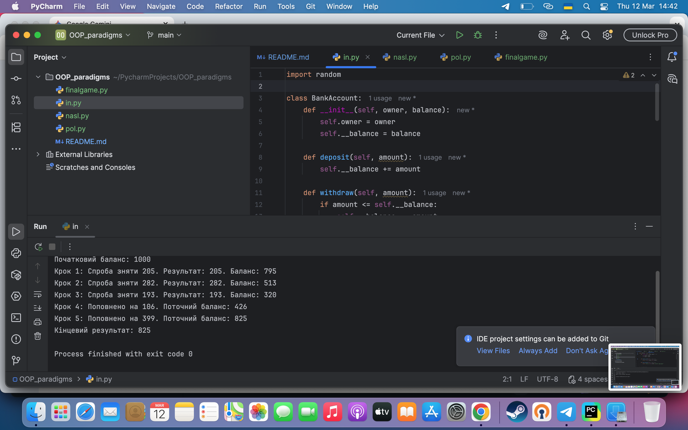
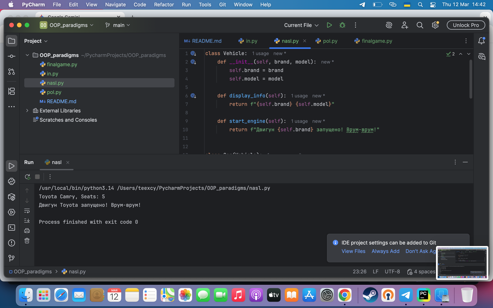
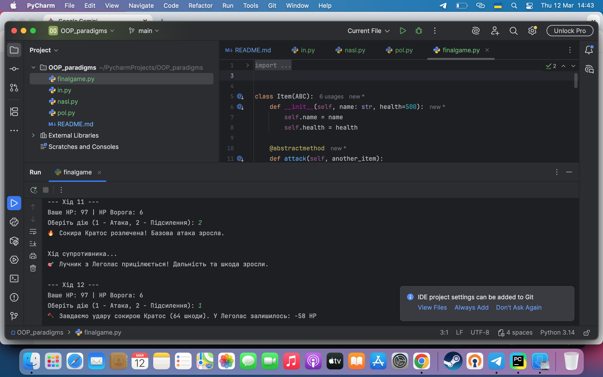

# Звіт до лабораторної роботи

**Тема:** Ключові поняття об’єктно-орієнтованого програмування (ООП) у Python.

**Мета роботи:** Ознайомитись з ключовими поняттями об’єктно-орієнтованого програмування (ООП) у Python та навчитися реалізовувати їх у власних класах на прикладі ігрової симуляції.

---

## Виконання роботи

В ході виконання лабораторної роботи було реалізовано 4 основні парадигми ООП та створено фінальну ігрову симуляцію.

### Завдання 1: Інкапсуляція
Розробили програму з класом `BankAccount`, яка демонструє роботу з приватними та публічними атрибутами. Додано генератор випадкових чисел для симуляції поповнення та зняття коштів у циклі. 

**Отримано наступні результати:**
Програма успішно імітує банківські операції, не дозволяючи зняти більше коштів, ніж є на рахунку.

 
*(Шлях до файлу зміни на свій, якщо він відрізняється)*

### Завдання 2: Наслідування
Створили клас-наслідувач `Car`, який переймає атрибути та методи базового класу `Vehicle`. Було додано новий метод `start_engine` у базовий клас та успішно викликано його через об'єкт дочірнього класу.

### Завдання 3: Поліморфізм
Розробили класи тварин (`Dog`, `Cat`, `Fish`), які наслідують базовий клас `Animal`. Перевірили поведінку об'єкта `Fish`, у якого відсутній перевизначений метод `speak()`.

**Результат:**
Програма вивела значення `None` для класу `Fish`, оскільки він використав порожній метод базового класу `Animal`.

### Завдання 4: Абстракція та створення простої гри
Було створено абстрактний клас `Item` та три класи зброї: `Sword`, `Axe` та новий клас `Bow`. 
Реалізовано:
* Унікальні формули атаки для кожного виду зброї (поліморфізм).
* Додано параметр `range_power` та метод `buff()` для лука та іншої зброї.
* Створено покрокову гру з випадковим вибором зброї для гравця та комп'ютера.

> Користувач тепер може обирати дію (Атака або Підсилення) у кожному раунді, що додає грі інтерактивності.

